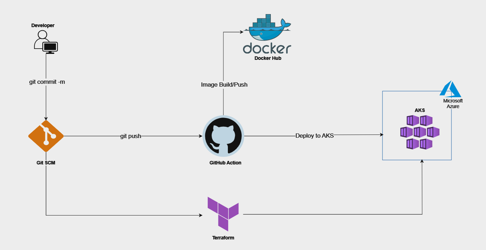

# Cloud DevOps Assessment Documentation

---
## Project Overview
This documentation provides a comprehensive guide for deploying a simple web application, containerizing it with Docker, provisioning infrastructure with Terraform on Azure, and setting up CI/CD with GitHub Actions.

The project involves several steps, each contributing to the seamless deployment and automation of the application.

## Architecture Design
The architecture of the project involves several components working together seamlessly:

1. **Docker Hub Repository**: The Docker repository hosts the simple web application image built from the codebase.
2. **Azure Kubernetes Service (AKS)**: The AKS cluster provides a scalable and managed Kubernetes environment for deploying and managing containerized applications.
3. **GitHub SCM**: The source code for this project is hosted on GitHub, and GitHub Actions are configured for CI/CD.
4. **GitHub Actions Workflow**: The workflow triggers build and deployment processes upon pushes to the main branch.
5. **Terraform Infrastructure**: Terraform scripts define the infrastructure required on Azure, and as per the project requirements, the networking components and the AKS cluster.

### Project Setup
- **Web Application**: The project starts with an existing simple web application codebase written in HTML and CSS.
- **Docker**: Docker is used to containerize the application, ensuring portability and consistent performance across different environments.
- **Terraform**: Terraform scripts are utilized to provision the required infrastructure on Azure, specifically focusing on an Azure Kubernetes Service (AKS) cluster.
- **GitHub Actions**: GitHub Actions are employed to automate the CI/CD pipeline, enabling continuous integration and deployment to the AKS cluster triggered by pushes to the main branch.

## Deployment Instructions
Follow these steps to deploy the web application, containerize it with Docker, provision infrastructure with Terraform, and set up CI/CD with GitHub Actions:

1. **Deploying the Web Application**:
    - Ensure you have the web application codebase ready.
    - Here is the link to the web application codebase [Application Code](./jupiter-main/)
    - Optionally, test the application locally to verify its functionality.
    
2. **Containerize Your Application with Docker**:
    - Write a Dockerfile to define the container environment.
    - Build the Docker image using `docker build`.
    - Here is the link to the docker file [Docker File](./Dockerfile)
    - Test the Docker container locally to ensure it runs smoothly.
    
3. **Provision Infrastructure with Terraform**:
    - Write Terraform scripts using modules to define the required infrastructure on Azure, including the AKS cluster.
    - Here is the link containing the scripts for the terraform module [Terraform Module](./aksmodule/)
    - Execute `terraform init`, `terraform plan`, and `terraform apply` to provision the infrastructure.
    
4. **Set Up CI/CD with GitHub Actions**:
    - Create GitHub Actions workflow YAML file in the `.github/workflows` directory.
    - Define the workflow to trigger build and deployment processes.
    - Ensure necessary secrets and environment variables are configured securely.
    - Here is the link to the github action workflows file and kubernetes deployment file [GitHub Action File](../perizer-internship-assessment/.github/workflows/main.yml) & [Deployment File](./deployment.yaml)
    - Test the workflow by pushing changes to the main branch.

## Learning Experience
Throughout this project, several insights were gained, and challenges were encountered. 

### Insights Gained:
- **Understanding Containerization**: Docker provided a robust solution for packaging the application and its dependencies.
- **Infrastructure as Code (IaC)**: Terraform enabled the provisioning of infrastructure in a repeatable and scalable manner.
- **CI/CD Automation**: GitHub Actions simplified the setup of CI/CD pipelines, automating the build and deployment processes seamlessly.

### Challenges Encountered:
- **Authentication Configuration**: Generating credentials for secure communication between platforms in the pipeline configuration posed a challenge, requiring careful management and configuration of secrets.
- **Kubeconfig Integration**: Implementing the kubeconfig file in the GitHub Actions pipeline for communication with the AKS cluster was challenging initially.
- **Service Principal Role Assignment**: Assigning the appropriate contributor role to the service principal used for infrastructure provisioning was not initially considered, which caused permissions issues.
- **Federated Credentials Generation**: Generating federated credentials for the GitHub Actions pipeline to authenticate with Azure services posed an additional challenge because i wasn't aware of it use case, finally understood the concept after going through several documentation.

## Conclusion
This project presented an opportunity to delve into various aspects of cloud DevOps, including containerization, infrastructure provisioning, and CI/CD automation. By following the outlined steps and embracing a continuous learning mindset, developers can streamline the deployment process and enhance collaboration within their teams.As technology continues to evolve, embracing best practices and staying updated with emerging trends will be essential for success in the ever-changing landscape of DevOps.
---
